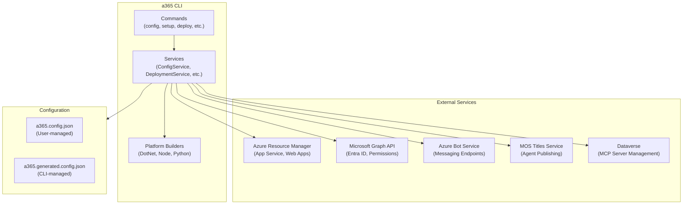

# Agent365-devTools Architecture

This document provides a high-level overview of the Microsoft Agent 365 DevTools repository architecture, design patterns, and architectural decisions.

> **For development how-to guides** (build, test, add commands, etc.), see [DEVELOPER.md](../src/DEVELOPER.md).

---

## Project Overview

The Microsoft Agent 365 CLI (`a365`) is a .NET 8.0 tool that automates the deployment and management of Microsoft Agent 365 applications on Azure. It provides:

- **Multiplatform deployment** (.NET, Node.js, Python) with automatic platform detection
- Agent blueprint and identity creation via Microsoft Graph API
- Messaging endpoint registration with Azure Bot Service
- Application deployment with Azure Oryx manifest generation
- Microsoft Graph API permissions and admin consent management
- Teams notifications registration
- MCP (Model Context Protocol) server configuration and management

---

## Repository Structure

```
Agent365-devTools/
├── src/
│   ├── Microsoft.Agents.A365.DevTools.Cli/        # Main CLI application
│   ├── Microsoft.Agents.A365.DevTools.MockToolingServer/  # Mock MCP server for testing
│   └── Tests/                                      # Test projects
├── docs/
│   ├── design.md                                   # This file - architecture overview
│   └── commands/                                   # Command-specific documentation
├── scripts/                                        # Build and utility scripts
└── CLAUDE.md                                       # Claude Code guidance
```

---

## Architecture Diagram



---

## Project Documentation

| Project | Description | Design Document |
|---------|-------------|-----------------|
| **Microsoft.Agents.A365.DevTools.Cli** | Main CLI application with commands, services, and platform builders | [CLI Design](../src/Microsoft.Agents.A365.DevTools.Cli/design.md) |
| **Microsoft.Agents.A365.DevTools.MockToolingServer** | Mock MCP server for local development and testing | [MockToolingServer Design](../src/Microsoft.Agents.A365.DevTools.MockToolingServer/design.md) |
| **Tests** | Unit and integration tests | See [DEVELOPER.md](../src/DEVELOPER.md#testing-strategy) |

---

## Key Architectural Patterns

### 1. Command Pattern (Spectre.Console)

Commands inherit from `AsyncCommand<Settings>` and return integer exit codes (0 = success). Each command has:
- A nested `Settings` class for command-line options
- An `ExecuteAsync` method containing the implementation
- Dependencies injected via constructor

```csharp
public class SetupCommand : AsyncCommand<SetupCommand.Settings>
{
    public class Settings : CommandSettings
    {
        [CommandOption("--config")]
        public string? ConfigFile { get; init; }
    }

    public override async Task<int> ExecuteAsync(CommandContext context, Settings settings)
    {
        // Implementation
        return 0; // Success
    }
}
```

### 2. Strategy Pattern (Platform Builders)

The `IPlatformBuilder` interface enables multiplatform deployment support:

```csharp
public interface IPlatformBuilder
{
    Task<bool> ValidateEnvironmentAsync();
    Task CleanAsync(string projectDir);
    Task<string> BuildAsync(string projectDir, string outputPath, bool verbose);
    Task<OryxManifest> CreateManifestAsync(string projectDir, string publishPath);
}
```

Implementations: `DotNetBuilder`, `NodeBuilder`, `PythonBuilder`

### 3. Two-File Configuration Model

Configuration is split into two files to separate user concerns from runtime state:

| File | Purpose | Version Control |
|------|---------|-----------------|
| `a365.config.json` | Static, user-managed settings (tenant ID, resource names) | Yes (no secrets) |
| `a365.generated.config.json` | Dynamic, CLI-managed state (IDs, timestamps) | No (gitignored) |

Both files are merged into a single `Agent365Config` model at runtime using `ConfigService`.

### 4. Dependency Injection

Services are registered in `Program.cs` using `Microsoft.Extensions.DependencyInjection`:
- Singletons for stateless services
- Transient for command-specific services
- Constructor injection throughout

---

## Architecture Decisions

### Why Unified Config Model?

**Problem:** Multiple config files (`setup.config.json`, `createinstance.config.json`, `deploy.config.json`) led to:
- Data duplication and inconsistency
- Manual merging required
- Type mismatches and errors

**Solution:** Single `Agent365Config` model with:
- Clear static (`init`) vs dynamic (`get; set`) semantics
- Automatic merge/split via `ConfigService`
- Type safety across all commands
- Single source of truth

### Why Two Config Files?

**Design Goals:**
- User config can be version controlled (without secrets)
- Generated state is gitignored (contains IDs and secrets)
- Clear ownership: users edit their config, CLI manages state

**Why not one file?** Separating concerns prevents accidental secret commits and makes config sharing easier.

**Why not three+ files?** Previous approach caused duplication and cognitive overhead.

### Why Spectre.Console?

Selected for:
- Rich, colorful console output
- Progress indicators and spinners
- Table formatting for status displays
- Robust command-line parsing
- Active development and community support

### Why Azure CLI Integration?

The CLI leverages Azure CLI for:
- Existing authentication session reuse
- Proven Azure operations
- Cross-platform compatibility
- Reduced maintenance burden

---

## Recent Features

### Custom Blueprint Permissions (Issue #194)

**Added**: February 2026

The CLI now supports configuring custom API permissions for agent blueprints beyond the standard set required for agent operation. This enables agents to access additional Microsoft Graph scopes (Presence, Files, Chat, etc.) or custom APIs.

**Key Components**:
- **Configuration Model**: `CustomResourcePermission` with GUID validation, scope validation, and duplicate detection
- **Configuration Command**: `a365 config permissions` to add/update/reset custom permissions in `a365.config.json`
- **Setup Commands**: `a365 setup permissions custom` and integration with `a365 setup all`
- **Storage**: Custom permissions stored in `a365.config.json` (static configuration)

**Architecture**:
```
User configures → a365.config.json → Setup applies → OAuth2 grants + Inheritable permissions
```

**Usage**:
```bash
# Configure custom permissions
a365 config permissions \
  --resource-app-id 00000003-0000-0000-c000-000000000000 \
  --scopes Presence.ReadWrite,Files.Read.All

# Apply to blueprint
a365 setup permissions custom

# Or use setup all (auto-applies if configured)
a365 setup all
```

**Design Highlights**:
- **Generic**: Supports Microsoft Graph, custom APIs, and first-party services
- **Idempotent**: Safe to run multiple times
- **Validated**: GUID format, scope presence, duplicate detection
- **Integrated**: Uses same `SetupHelpers.EnsureResourcePermissionsAsync` as standard permissions
- **Portal Visible**: Permissions appear in Azure Portal API permissions list

**Documentation**:
- Design: [design-custom-resource-permissions.md](./design-custom-resource-permissions.md)
- Command Reference: [setup-permissions-custom.md](./commands/setup-permissions-custom.md)
- GitHub Issue: [#194](https://github.com/microsoft/Agent365-devTools/issues/194)

---

## Cross-References

- **[CLI Design](../src/Microsoft.Agents.A365.DevTools.Cli/design.md)** - Detailed CLI architecture, folder structure, configuration system
- **[MockToolingServer Design](../src/Microsoft.Agents.A365.DevTools.MockToolingServer/design.md)** - Mock MCP server architecture
- **[Developer Guide](../src/DEVELOPER.md)** - Build, test, contribute, add commands
- **[CLAUDE.md](../CLAUDE.md)** - Claude Code guidance for this repository

---

## Related Documentation

- [CLI Usage Guide](../Readme-Usage.md) - End-user documentation
- [Command Documentation](./commands/) - Individual command reference
- [Code Standards](../.github/copilot-instructions.md) - Coding conventions and review rules
