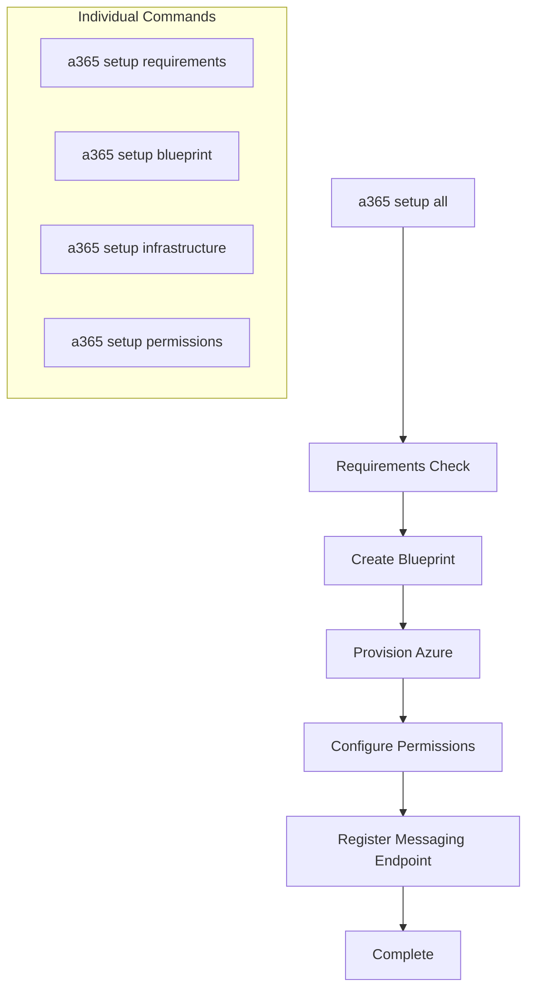

# SetupSubcommands

This folder contains the workflow components for the `a365 setup` command. The setup process is divided into discrete subcommands that can run independently or as part of the full workflow.

> **Parent:** [Commands](../README.md) | **CLI Design:** [design.md](../../design.md)

---

## Component Reference

| Component | File | Description |
|-----------|------|-------------|
| **AllSubcommand** | `AllSubcommand.cs` | Orchestrates the complete setup workflow (`a365 setup all`) |
| **BlueprintSubcommand** | `BlueprintSubcommand.cs` | Creates agent blueprint application registration |
| **InfrastructureSubcommand** | `InfrastructureSubcommand.cs` | Provisions Azure infrastructure (App Service, etc.) |
| **PermissionsSubcommand** | `PermissionsSubcommand.cs` | Configures Graph API permissions and admin consent |
| **RequirementsSubcommand** | `RequirementsSubcommand.cs` | Validates prerequisites (Azure CLI, permissions) |
| **SetupHelpers** | `SetupHelpers.cs` | Shared helper methods for setup operations |
| **SetupResults** | `SetupResults.cs` | Result models for setup operations |

---

## Setup Workflow



### Workflow Steps

1. **Requirements** - Validate Azure CLI authentication, subscription access, required permissions
2. **Blueprint** - Create Entra ID application registration for the agent blueprint
3. **Infrastructure** - Provision Azure App Service, configure app settings
4. **Permissions** - Configure Microsoft Graph API permissions, grant admin consent
5. **Messaging Endpoint** - Register bot messaging endpoint with Azure Bot Service

---

## Usage

```bash
# Run complete setup
a365 setup all

# Run individual steps
a365 setup requirements    # Check prerequisites only
a365 setup blueprint       # Create blueprint only
a365 setup infrastructure  # Provision Azure only
a365 setup permissions     # Configure permissions only
```

---

## SetupHelpers

The `SetupHelpers.cs` file contains shared functionality:

- **EnsureResourcePermissionsAsync** - Configures all three permission layers with retry logic
- **WaitForPermissionPropagationAsync** - Waits for Entra ID permission propagation
- **ValidateConfigurationAsync** - Validates configuration before setup operations

---

## Cross-References

- **[Commands/](../README.md)** - Parent commands folder
- **[Services/](../../Services/README.md)** - Business logic services used by setup
- **[CLI Design](../../design.md)** - Permissions architecture details
