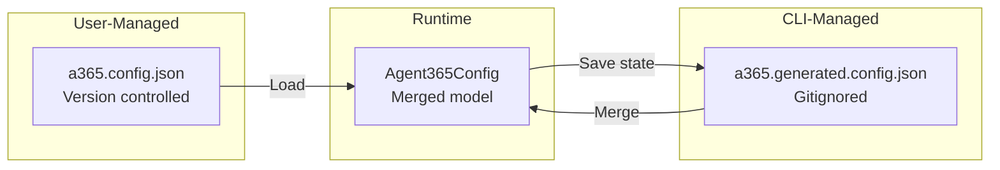
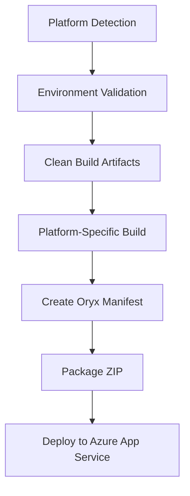
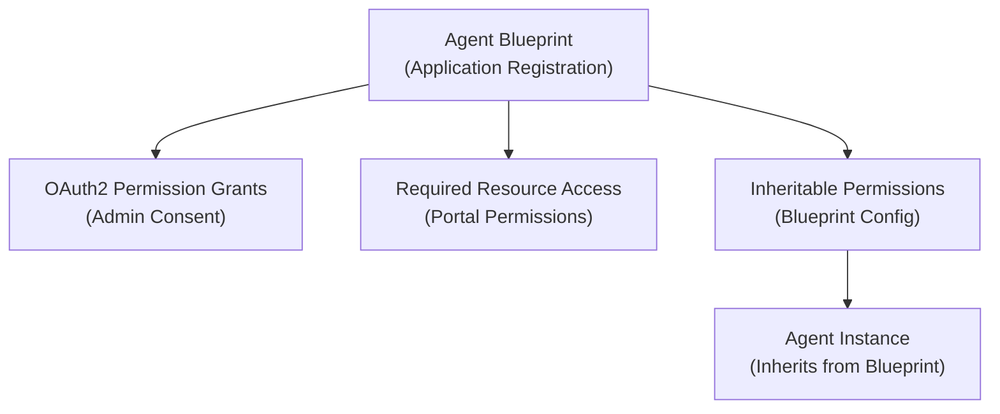

# Microsoft.Agents.A365.DevTools.Cli - Architecture

This document describes the architecture of the main CLI application. For development how-to guides, see [DEVELOPER.md](../DEVELOPER.md).

> **Parent:** [Repository Design](../../docs/design.md)

---

## Project Structure

```
Microsoft.Agents.A365.DevTools.Cli/
├── Program.cs                    # CLI entry point, DI registration, command registration
├── Commands/                     # Command implementations
│   ├── ConfigCommand.cs          # a365 config (init, display)
│   ├── SetupCommand.cs           # a365 setup (blueprint + messaging endpoint)
│   ├── CreateInstanceCommand.cs  # a365 create-instance (identity, licenses, notifications)
│   ├── DeployCommand.cs          # a365 deploy
│   ├── CleanupCommand.cs         # a365 cleanup (delete resources)
│   ├── QueryEntraCommand.cs      # a365 query-entra (blueprint-scopes, instance-scopes)
│   ├── DevelopCommand.cs         # a365 develop (development utilities)
│   ├── DevelopMcpCommand.cs      # a365 develop-mcp (MCP server management)
│   ├── PublishCommand.cs         # a365 publish (MOS Titles publishing)
│   └── SetupSubcommands/         # Setup workflow components
├── Services/                     # Business logic services
│   ├── ConfigService.cs          # Configuration management
│   ├── DeploymentService.cs      # Multiplatform Azure deployment
│   ├── PlatformDetector.cs       # Automatic platform detection
│   ├── IPlatformBuilder.cs       # Platform builder interface
│   ├── DotNetBuilder.cs          # .NET project builder
│   ├── NodeBuilder.cs            # Node.js project builder
│   ├── PythonBuilder.cs          # Python project builder
│   ├── BotConfigurator.cs        # Messaging endpoint registration
│   ├── GraphApiService.cs        # Graph API interactions
│   ├── AuthenticationService.cs  # MSAL.NET authentication
│   └── Helpers/                  # Service helper utilities
├── Models/                       # Data models
│   ├── Agent365Config.cs         # Unified configuration model
│   ├── ProjectPlatform.cs        # Platform enumeration
│   └── OryxManifest.cs           # Azure Oryx manifest model
├── Constants/                    # Centralized constants
│   ├── ErrorCodes.cs             # Error code definitions
│   ├── ErrorMessages.cs          # Error message templates
│   └── AuthenticationConstants.cs # Auth-related constants
├── Exceptions/                   # Custom exception types
├── Helpers/                      # Utility helpers
└── Templates/                    # Embedded resources (manifest.json, icons)
```

---

## Folder Documentation

| Folder | Purpose | README |
|--------|---------|--------|
| **Commands/** | CLI command implementations | [README](Commands/README.md) |
| **Commands/SetupSubcommands/** | Setup workflow components | [README](Commands/SetupSubcommands/README.md) |
| **Services/** | Business logic services | [README](Services/README.md) |
| **Services/Helpers/** | Service helper utilities | [README](Services/Helpers/README.md) |
| **Models/** | Data models | [README](Models/README.md) |
| **Constants/** | Centralized constants | [README](Constants/README.md) |
| **Exceptions/** | Custom exception types | [README](Exceptions/README.md) |
| **Helpers/** | Utility helpers | [README](Helpers/README.md) |

---

## Configuration System Architecture

### Two-File Design

The CLI uses a unified configuration model with a clear separation between static (user-managed) and dynamic (CLI-managed) data.



| File | Content | Editing |
|------|---------|---------|
| `a365.config.json` | Tenant ID, subscription, resource names, project path | User edits |
| `a365.generated.config.json` | Agent blueprint ID, identity ID, consent status | CLI generates |

### Configuration File Storage and Portability

Both configuration files are stored in **two locations**:

1. **Project Directory** (optional, for local development)
2. **%LocalAppData%\Microsoft.Agents.A365.DevTools.Cli** (authoritative, for portability)

This dual-storage design enables **CLI portability** - users can run `a365` commands from any directory on their system, not just the project directory. The `deploymentProjectPath` property points to the actual project location.

**File Resolution Strategy:**
- **Load**: Current directory first, then %LocalAppData% (fallback)
- **Save**: Write to **both** locations to maintain consistency
- **Sync**: When static config is loaded from current directory, it's automatically synced to %LocalAppData%

### Agent365Config Model Design

The unified model uses C# property patterns to enforce immutability:

```csharp
public class Agent365Config
{
    // STATIC PROPERTIES (init-only) - from a365.config.json
    // Set once during configuration, never change at runtime
    public string TenantId { get; init; } = string.Empty;
    public string SubscriptionId { get; init; } = string.Empty;
    public string ResourceGroup { get; init; } = string.Empty;
    public string WebAppName { get; init; } = string.Empty;
    public string DeploymentProjectPath { get; init; } = string.Empty;

    // DYNAMIC PROPERTIES (get/set) - from a365.generated.config.json
    // Modified at runtime by CLI operations
    public string? AgentBlueprintId { get; set; }
    public string? AgentIdentityId { get; set; }
    public string? AgentUserId { get; set; }
    public string? AgentUserPrincipalName { get; set; }
    public bool? Consent1Granted { get; set; }
    public bool? Consent2Granted { get; set; }
    public bool? Consent3Granted { get; set; }
}
```

**Design Principles:**
- `init` properties = Immutable after construction = Static config
- `get; set` properties = Mutable = Dynamic state
- `ConfigService` handles merge (load) and split (save) logic

### Environment Variable Overrides

For security and flexibility, the CLI supports environment variable overrides:

| Variable | Purpose |
|----------|---------|
| `A365_MCP_APP_ID` | Override Agent 365 Tools App ID for authentication |
| `A365_MCP_APP_ID_{ENV}` | Per-environment MCP Platform App ID |
| `A365_DISCOVER_ENDPOINT_{ENV}` | Per-environment discover endpoint URL |
| `MOS_TITLES_URL` | Override MOS Titles service URL |
| `POWERPLATFORM_API_URL` | Override Power Platform API URL |

**Design Decision:** All test/preprod App IDs and URLs have been removed from the codebase. The production App ID is the only hardcoded value. Internal Microsoft developers use environment variables for non-production testing.

---

## Command Pattern Implementation

Commands follow the Spectre.Console `AsyncCommand<T>` pattern:

```csharp
public class SetupCommand : AsyncCommand<SetupCommand.Settings>
{
    private readonly ILogger<SetupCommand> _logger;
    private readonly IConfigService _configService;

    public SetupCommand(ILogger<SetupCommand> logger, IConfigService configService)
    {
        _logger = logger;
        _configService = configService;
    }

    public class Settings : CommandSettings
    {
        [CommandOption("--config")]
        [Description("Path to configuration file")]
        public string? ConfigFile { get; init; }

        [CommandOption("--non-interactive")]
        [Description("Run without interactive prompts")]
        public bool NonInteractive { get; init; }
    }

    public override async Task<int> ExecuteAsync(CommandContext context, Settings settings)
    {
        _logger.LogInformation("Starting setup...");
        // Implementation
        return 0; // Success
    }
}
```

**Guidelines:**
- Keep commands thin - delegate business logic to services
- Use dependency injection for services
- Return 0 for success, non-zero for errors (use `ErrorCodes`)
- Log progress with `ILogger<T>` and structured placeholders

---

## Multiplatform Deployment Architecture

### Platform Detection

The `PlatformDetector` service auto-detects project type from files:

```csharp
public enum ProjectPlatform
{
    Unknown, DotNet, NodeJs, Python
}
```

| Platform | Detection Files |
|----------|-----------------|
| .NET | `*.csproj`, `*.fsproj`, `*.vbproj` |
| Node.js | `package.json` |
| Python | `requirements.txt`, `setup.py`, `pyproject.toml`, `*.py` |

Detection priority: .NET > Node.js > Python > Unknown

### Platform Builder Interface

```csharp
public interface IPlatformBuilder
{
    Task<bool> ValidateEnvironmentAsync();      // Check required tools installed
    Task CleanAsync(string projectDir);         // Clean build artifacts
    Task<string> BuildAsync(string projectDir, string outputPath, bool verbose);
    Task<OryxManifest> CreateManifestAsync(string projectDir, string publishPath);
}
```

### Deployment Pipeline



1. **Platform Detection** - Auto-detect project type from files
2. **Environment Validation** - Check required tools (dotnet/node/python)
3. **Clean** - Remove previous build artifacts
4. **Build** - Platform-specific build process
5. **Manifest Creation** - Generate Azure Oryx manifest
6. **Package** - Create deployment ZIP
7. **Deploy** - Upload to Azure App Service

### Restart Mode (`--restart` flag)

For quick iteration after manual changes to the `publish/` folder:

```bash
a365 deploy           # Full pipeline: steps 1-7
a365 deploy --restart # Quick mode: steps 6-7 only (packaging + deploy)
```

---

## Permissions Architecture

The CLI configures three layers of permissions for agent blueprints:

1. **OAuth2 Grants** - Admin consent via Graph API `/oauth2PermissionGrants`
2. **Required Resource Access** - Portal-visible permissions (Entra ID "API permissions")
3. **Inheritable Permissions** - Blueprint-level permissions that instances inherit automatically



**Unified Configuration:** `SetupHelpers.EnsureResourcePermissionsAsync` handles all three layers plus verification with retry logic (exponential backoff: 2s, 4s, 8s, 16s, 32s, max 5 retries).

**Per-Resource Tracking:** `ResourceConsent` model tracks inheritance state per resource (Agent 365 Tools, Messaging Bot API, Observability API).

---

## Entry Point (Program.cs)

The entry point handles:

1. **Logging Configuration** - Serilog with console and file sinks
2. **Dependency Injection** - Service registration via `IServiceCollection`
3. **Command Registration** - Commands registered with Spectre.Console.Cli
4. **Exception Handling** - Global exception handler with user-friendly messages

```csharp
// Simplified structure
var services = new ServiceCollection();
services.AddSingleton<IConfigService, ConfigService>();
services.AddSingleton<IDeploymentService, DeploymentService>();
// ... more services

var app = new CommandApp(new TypeRegistrar(services));
app.Configure(config =>
{
    config.AddCommand<ConfigCommand>("config");
    config.AddCommand<SetupCommand>("setup");
    config.AddCommand<DeployCommand>("deploy");
    // ... more commands
});

return await app.RunAsync(args);
```

---

## Cross-References

- **[Repository Design](../../docs/design.md)** - High-level architecture overview
- **[Developer Guide](../DEVELOPER.md)** - Build, test, add commands, contribute
- **[Commands README](Commands/README.md)** - Command implementations
- **[Services README](Services/README.md)** - Business logic services
