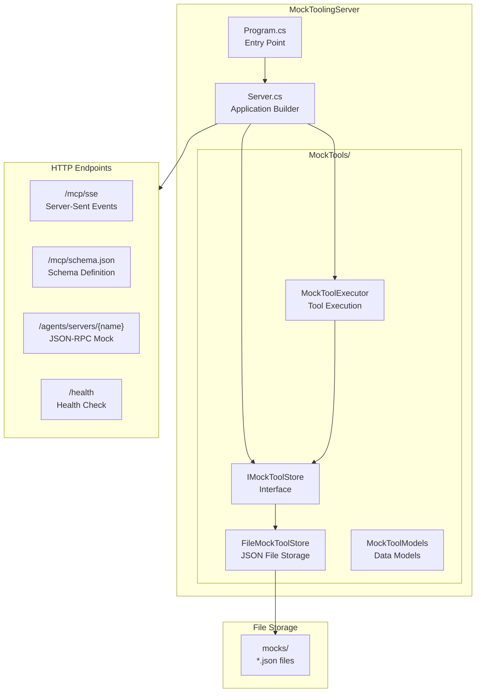

# Microsoft.Agents.A365.DevTools.MockToolingServer - Architecture

This document describes the architecture of the Mock MCP Tooling Server used for local development and testing.

> **Parent:** [Repository Design](../../docs/design.md)

---

## Purpose

The MockToolingServer is a standalone ASP.NET Core application that provides a mock implementation of the Model Context Protocol (MCP) for local development and testing. It enables developers to:

- Test MCP integrations without connecting to production services
- Define mock tools with customizable responses
- Simulate various response scenarios (delays, errors, dynamic content)
- Hot-reload mock definitions without server restart

---

## Architecture Diagram



---

## Component Reference

| Component | File | Responsibility |
|-----------|------|----------------|
| **Program** | `Program.cs` | Entry point, delegates to `Server.Start()` |
| **Server** | `Server.cs` | WebApplication builder, DI registration, endpoint mapping |
| **IMockToolStore** | `MockTools/IMockToolStore.cs` | Interface for mock tool storage operations |
| **FileMockToolStore** | `MockTools/FileMockToolStore.cs` | JSON file-based storage with hot-reload via FileSystemWatcher |
| **IMockToolExecutor** | `MockTools/MockToolExecutor.cs` | Interface for tool execution |
| **MockToolExecutor** | `MockTools/MockToolExecutor.cs` | Tool listing and execution with template rendering |
| **MockToolDefinition** | `MockTools/MockToolModels.cs` | Model for mock tool configuration |
| **MockToolStoreOptions** | `MockTools/MockToolModels.cs` | Options for store configuration |

---

## Mock Tool JSON Schema

Mock tools are defined in JSON files under the `mocks/` directory. Each file represents an MCP server:

```json
[
  {
    "name": "get_weather",
    "description": "Get weather for a location",
    "inputSchema": {
      "type": "object",
      "properties": {
        "location": { "type": "string", "description": "City name" }
      },
      "required": ["location"]
    },
    "responseTemplate": "The weather in {{location}} is sunny and 72F",
    "delayMs": 0,
    "errorRate": 0.0,
    "statusCode": 200,
    "enabled": true
  }
]
```

| Field | Type | Description |
|-------|------|-------------|
| `name` | string | Tool identifier |
| `description` | string | Human-readable description |
| `inputSchema` | object | JSON Schema for input parameters |
| `responseTemplate` | string | Response template with `{{placeholder}}` syntax |
| `delayMs` | number | Simulated delay in milliseconds |
| `errorRate` | number | Error probability (0.0 - 1.0) |
| `statusCode` | number | HTTP status code for responses |
| `enabled` | boolean | Whether tool is active |

### Template Placeholders

The `responseTemplate` supports `{{placeholder}}` syntax for dynamic content:
- Placeholders are replaced with matching argument values (case-insensitive)
- Unmatched placeholders remain visible in the response
- Special placeholders: `{{name}}` refers to the tool name

---

## HTTP Endpoints

### MCP Standard Endpoints

| Endpoint | Method | Description |
|----------|--------|-------------|
| `/mcp/sse` | GET | Server-Sent Events transport for MCP protocol |
| `/mcp/schema.json` | GET | MCP schema definition |

### Mock-Specific Endpoints

| Endpoint | Method | Description |
|----------|--------|-------------|
| `/agents/servers/{mcpServerName}` | POST | JSON-RPC endpoint for mock tool calls |
| `/health` | GET | Health check returning status and endpoint info |

### JSON-RPC Methods

The `/agents/servers/{mcpServerName}` endpoint supports:

| Method | Description |
|--------|-------------|
| `initialize` | Returns server capabilities and info |
| `logging/setLevel` | Acknowledges log level change (no-op) |
| `tools/list` | Returns list of enabled tools for the server |
| `tools/call` | Executes a tool and returns mock response |

**Example Request:**
```json
{
  "jsonrpc": "2.0",
  "id": 1,
  "method": "tools/call",
  "params": {
    "name": "get_weather",
    "arguments": { "location": "Seattle" }
  }
}
```

**Example Response:**
```json
{
  "jsonrpc": "2.0",
  "id": 1,
  "result": {
    "content": [{ "type": "text", "text": "The weather in Seattle is sunny and 72F" }],
    "isMock": true,
    "tool": "get_weather",
    "usedArguments": { "location": "Seattle" },
    "template": "The weather in {{location}} is sunny and 72F",
    "missingPlaceholders": []
  }
}
```

---

## Transport Protocols

### Server-Sent Events (SSE)

The MCP SDK provides SSE transport at `/mcp/sse` for real-time bidirectional communication:
- Mapped via `app.MapMcp()`
- Supports standard MCP protocol messages
- Used by MCP clients for streaming responses

### HTTP JSON-RPC

The `/agents/servers/{mcpServerName}` endpoint provides HTTP JSON-RPC transport:
- Standard JSON-RPC 2.0 protocol
- Supports multiple MCP servers via path parameter
- Returns mock responses with metadata

---

## Hot-Reload Support

The `FileMockToolStore` uses `FileSystemWatcher` to detect changes to mock definition files:

1. **Watch Events:** `Changed`, `Created`, `Renamed`
2. **Automatic Reload:** Cache is cleared and reloaded on file change
3. **Thread Safety:** Uses `SemaphoreSlim` for concurrent access protection
4. **Graceful Error Handling:** Failed reloads are logged but don't crash the server

---

## Usage

### Starting the Server

```bash
# From the MockToolingServer directory
dotnet run

# Or via the CLI
a365 develop mock-tooling-server
```

### Creating Mock Tools

1. Create a JSON file in the `mocks/` directory (e.g., `mocks/MyServer.json`)
2. Add tool definitions following the schema above
3. Server auto-detects new files on startup
4. Modify files at runtime for hot-reload

---

## Cross-References

- **[Repository Design](../../docs/design.md)** - High-level architecture overview
- **[CLI Design](../Microsoft.Agents.A365.DevTools.Cli/design.md)** - CLI architecture
- **[Developer Guide](../DEVELOPER.md)** - Build, test, contribute
